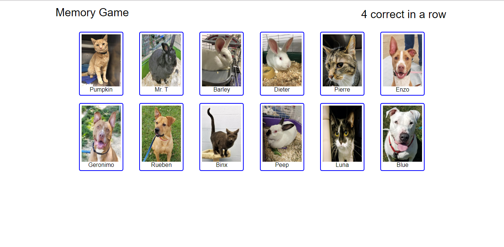

# Memory-Game

A simple memory game written with React.js.  Click on the animal cards one at a time until all twelve have been clicked.  You lose if you click on any of them a second time before all 12 have been selected.

You can try it out [here](https://bmccutchanjr.github.io/Memory-Game) or if you like, watch the [video](https://drive.google.com/file/d/1HuYCTEwePVI-8rfWadSFCWIQA_0AMKih/view).

Special thanks to the [Humane Society of Summit County](http://summithumane.org).  All of the animals featured in this app are available for adoption.

## React

React.js is a JavaScript framework that allows for more rapid development than might be possible with vanilla JavaScript.  This is acceived through the use of modularized components and the ReactDOM engine.  Rather than using JavaScript (or perhaps jQuery) to manipulate the browser's DOM, simple components are created and grouped together using a combination of JSX and JavaScript classes.

React frees the developer from the time consuming nuts and bolts of page structure and allows us to focus on the more critical business logic the app is trying to acheive.

## The application

Memory game is constructed with four React component: App, Title, Wrapper and Card.  `App.js` is, of course, the entry point for the application.

`Title.js` is the page header and score board.

`Card.js` is the component that renders each of the animals to the page.

`Wrapper.js` is a simple 
 component that serves to wrap the components in `App.js`.  JSX returns only one component.  So if we want to render multiple components they must be wrapped by yet another.